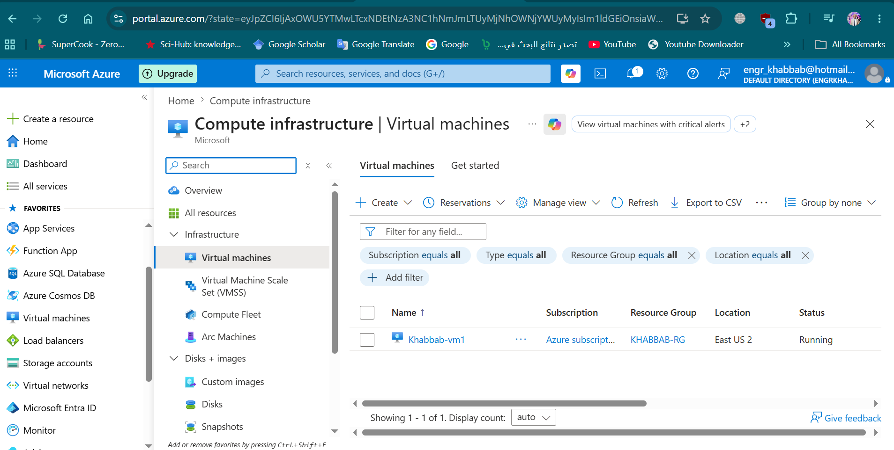
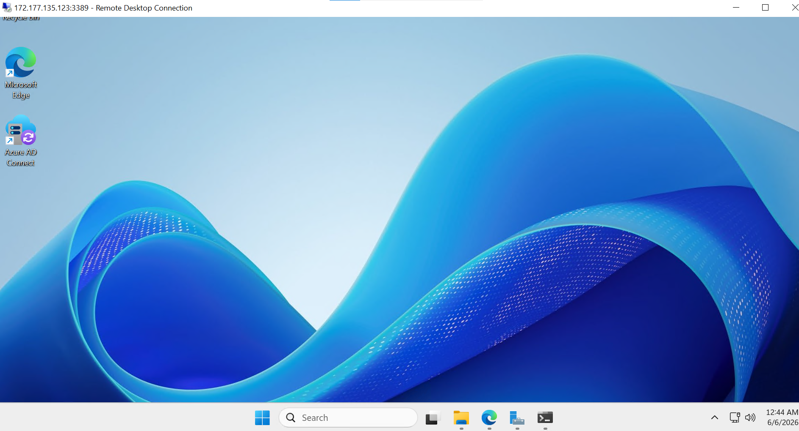
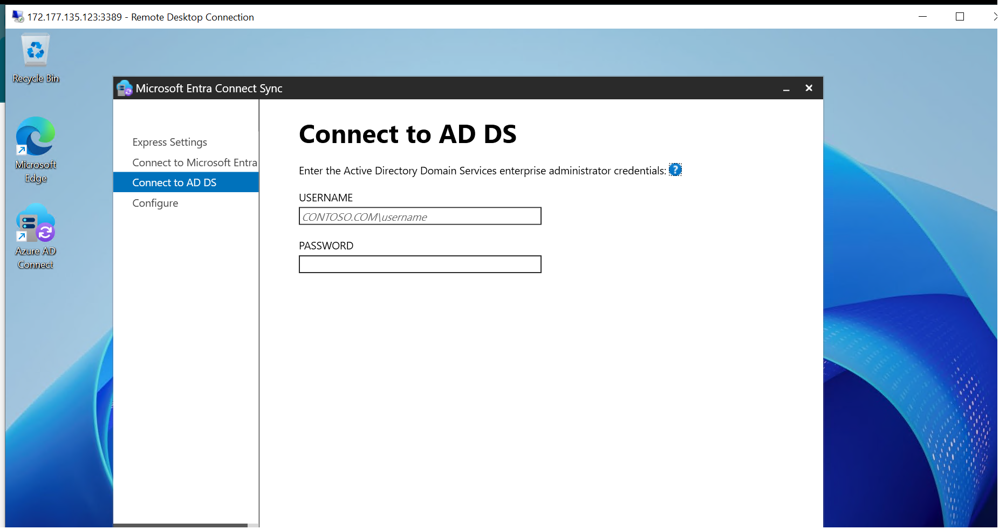
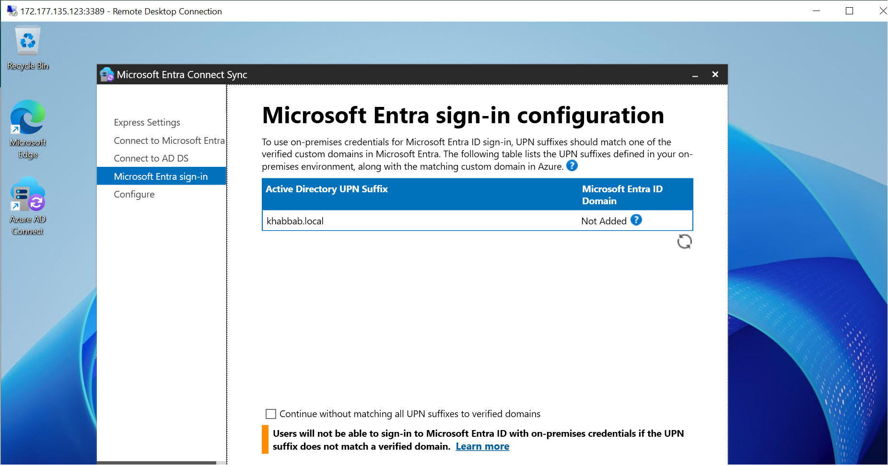
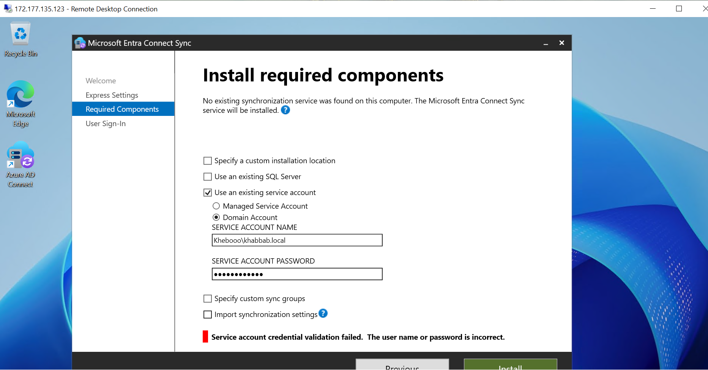
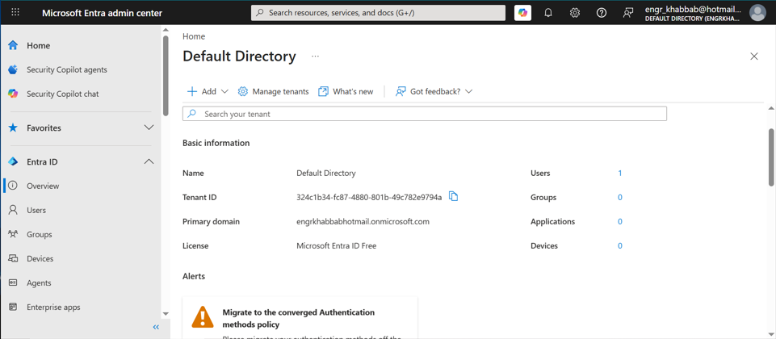
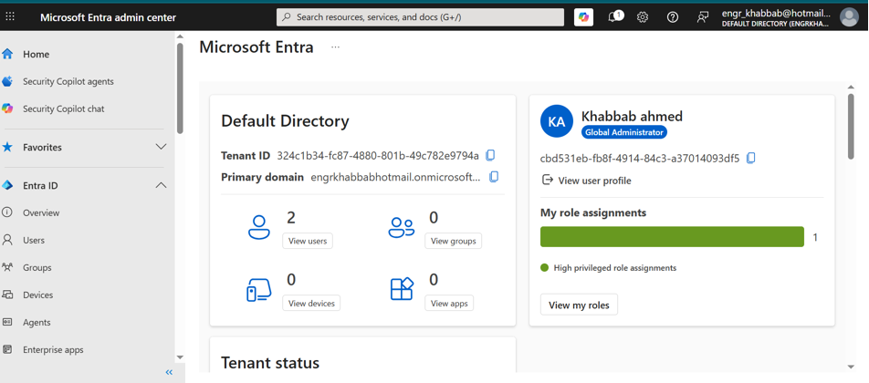

# Hybrid Identity with Microsoft Entra Connect Lab

## Project Overview

This lab demonstrates the deployment of a hybrid identity environment using Microsoft Entra ID (Azure AD), Windows Server 2025, Active Directory Domain Services (AD DS), and Microsoft Entra Connect Sync.

The objective was to build an on-premises Active Directory environment, create a domain, connect it to Microsoft Entra ID, and explore hybrid identity synchronization concepts commonly used in enterprise environments.

---

## Technologies Used

- Microsoft Azure
- Microsoft Entra ID (Azure AD)
- Microsoft Entra Connect Sync
- Windows Server 2025 Datacenter
- Active Directory Domain Services (AD DS)
- DNS
- Remote Desktop Protocol (RDP)

---

## Lab Objectives

- Deploy a Windows Server 2025 VM in Azure.
- Install and configure Active Directory Domain Services.
- Create and configure a new domain.
- Explore Microsoft Entra ID tenant management.
- Configure Microsoft Entra Connect Sync.
- Understand hybrid identity architecture.
- Review authentication and synchronization options.

---

## Architecture

```text
+-----------------------------+
| Microsoft Entra ID Tenant   |
| (Cloud Identity Platform)   |
+-------------+---------------+
              |
              |
      Microsoft Entra Connect
              |
              |
+-------------+---------------+
| Windows Server 2025         |
| Active Directory (AD DS)    |
| Domain: khabbab.local       |
+-----------------------------+
```

---

## Screenshots

### Azure Virtual Machine



---

### Windows Server 2025



---

### Active Directory Domain Services Connection



---

### Local Domain Configuration


---

### Microsoft Entra Sign-in Configuration



---

### Microsoft Entra Authentication Configuration



---

### Microsoft Entra Tenant Details



---

### Microsoft Entra Overview



---

## Skills Demonstrated

- Azure Virtual Machine Administration
- Windows Server Administration
- Active Directory Domain Services (AD DS)
- DNS Fundamentals
- Hybrid Identity Concepts
- Microsoft Entra ID Administration
- Microsoft Entra Connect Configuration
- Identity and Access Management (IAM)
- Cloud and On-Premises Integration
- Infrastructure Documentation

---

## Key Learnings

Through this lab I gained hands-on experience with:

- Deploying infrastructure in Microsoft Azure.
- Creating and managing an Active Directory domain.
- Understanding Microsoft Entra ID tenant architecture.
- Exploring hybrid identity integration.
- Configuring Microsoft Entra Connect Sync.
- Managing identity services across cloud and on-premises environments.

---

## Author

**Khabbab Mujtaba**

- LinkedIn: https://www.linkedin.com/in/khabbabmujtaba
- GitHub: https://github.com/Engrkhabbab

---

## Disclaimer

This project was created for educational and portfolio purposes to demonstrate practical experience with Microsoft Azure, Active Directory, and Microsoft Entra technologies.
